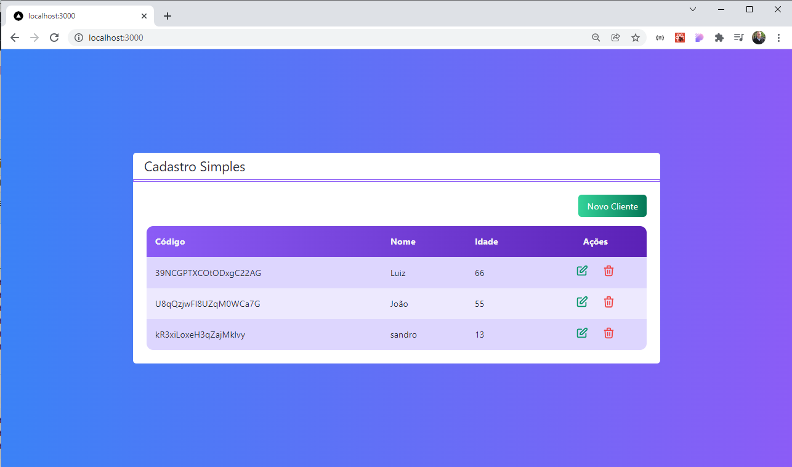
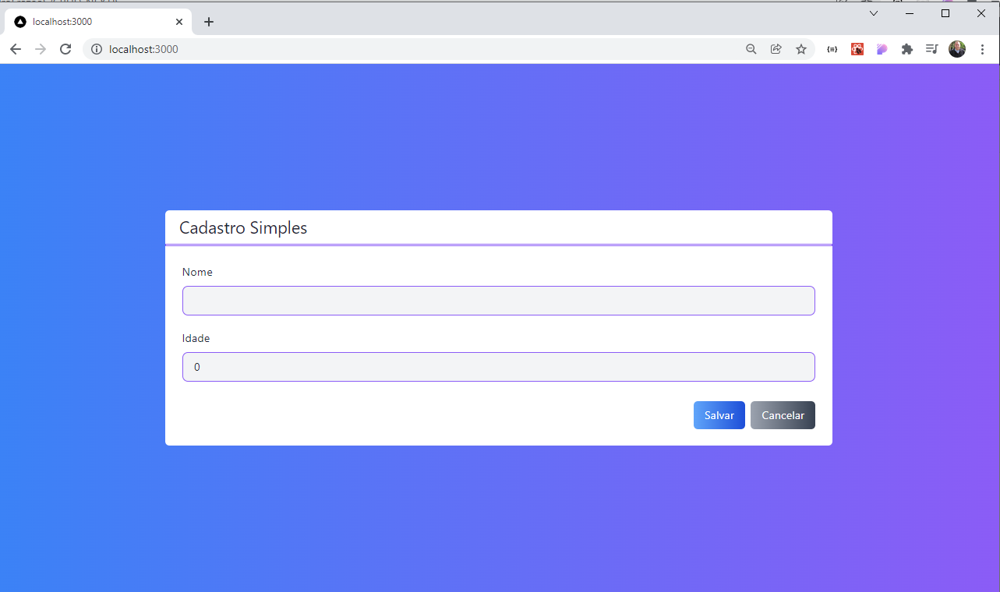
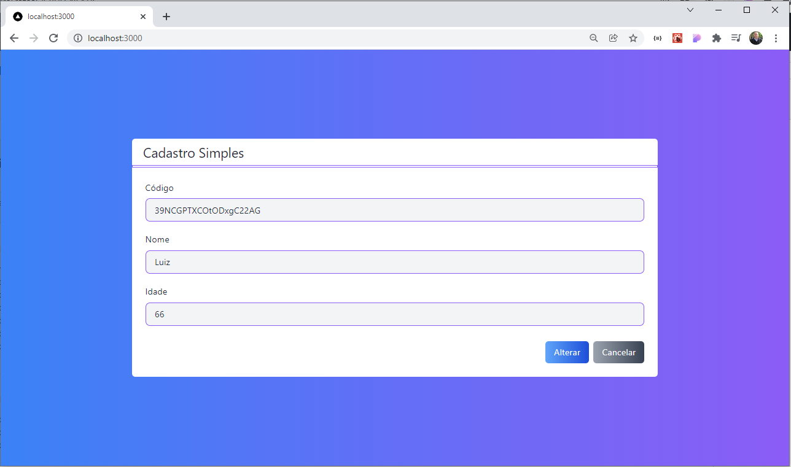

CRUD desenvolvido em **Nextjs** com **TypeScript** inteiramente componentizado. Para o css foi utilizado tailwind e para armazenamento dos dados o firebase.

  
Curso Udemy - Next.js e React: Crud - Full Stack Next JS

  
Instrutor - Leonardo Moura Leitao

  

### Layout do projeto

Tela Principal -  Lista.

  

Cadastro.

  

Alteração.

  

  <small>Sandro - 2022</small>

